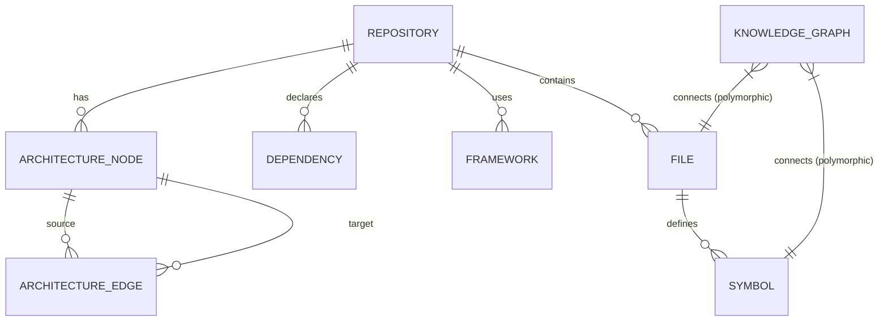

# Data Model: Repository Analysis Pipeline

**Date**: 2026-07-10
**Status**: Draft (Pending Review)

## 1. Entity Definitions & Relationships

### Repository
- **Purpose**: Represents an analyzed GitHub repository.
- **Key Fields**: `id`, `url`, `local_path`, `clone_date`, `last_analysis_date`, `commit_hash`, `size_bytes`
- **Relationships**: 
  - Has many `File`s
  - Has many `Dependency`s
  - Has many `Framework`s

### File
- **Purpose**: Represents a source file within a repository.
- **Key Fields**: `id`, `repository_id`, `path`, `language`, `size_bytes`, `last_modified`, `ast_hash`
- **Relationships**:
  - Belongs to `Repository`
  - Has many `Symbol`s
  - Belongs to `ArchitectureNode` (many-to-many via edges or directly)

### Symbol
- **Purpose**: Represents a parsed symbol (class, function, variable, import, export).
- **Key Fields**: `id`, `file_id`, `name`, `kind`, `line_start`, `line_end`
- **Relationships**:
  - Belongs to `File`
  - Has many `KnowledgeGraph` edges (e.g., depends on other symbols, calls other symbols)

### Dependency
- **Purpose**: Represents a package dependency extracted from manifests (e.g., package.json, requirements.txt).
- **Key Fields**: `id`, `repository_id`, `package_name`, `version`, `source_file`, `type`
- **Relationships**:
  - Belongs to `Repository`

### Framework
- **Purpose**: Represents a detected framework (e.g., React, Express, FastAPI).
- **Key Fields**: `id`, `repository_id`, `name`, `version`, `evidence` (JSON)
- **Relationships**:
  - Belongs to `Repository`

### ArchitectureNode
- **Purpose**: Represents a logical component or module in the architecture.
- **Key Fields**: `id`, `repository_id`, `name`, `node_type`
- **Relationships**:
  - Connects to other `ArchitectureNode`s via `ArchitectureEdge`s

### ArchitectureEdge
- **Purpose**: Represents relationships between architecture nodes.
- **Key Fields**: `id`, `source_node_id`, `target_node_id`, `relationship_type`

### KnowledgeGraph (Edges Table)
- **Purpose**: A universal edge table to link any two entities together for flexible traversals (e.g., symbol-calls-symbol, file-imports-file, symbol-implements-framework).
- **Key Fields**: `id`, `source_id`, `source_type`, `target_id`, `target_type`, `relationship`, `metadata`

## 2. Relationship Diagram (Mermaid ERD)



## 3. SQLite Schema

```sql
-- Repositories
CREATE TABLE repository (
    id INTEGER PRIMARY KEY AUTOINCREMENT,
    url TEXT NOT NULL,
    local_path TEXT NOT NULL,
    clone_date DATETIME NOT NULL,
    last_analysis_date DATETIME NOT NULL,
    commit_hash TEXT NOT NULL,
    size_bytes INTEGER NOT NULL,
    UNIQUE(url)
);

-- Files
CREATE TABLE file (
    id INTEGER PRIMARY KEY AUTOINCREMENT,
    repository_id INTEGER NOT NULL,
    path TEXT NOT NULL,
    language TEXT NOT NULL,
    size_bytes INTEGER NOT NULL,
    last_modified DATETIME NOT NULL,
    ast_hash TEXT NOT NULL,
    FOREIGN KEY(repository_id) REFERENCES repository(id) ON DELETE CASCADE,
    UNIQUE(repository_id, path)
);

CREATE INDEX idx_file_repo_path ON file(repository_id, path);

-- Symbols
CREATE TABLE symbol (
    id INTEGER PRIMARY KEY AUTOINCREMENT,
    file_id INTEGER NOT NULL,
    name TEXT NOT NULL,
    kind TEXT NOT NULL,
    line_start INTEGER NOT NULL,
    line_end INTEGER NOT NULL,
    FOREIGN KEY(file_id) REFERENCES file(id) ON DELETE CASCADE
);

CREATE INDEX idx_symbol_file ON symbol(file_id);
CREATE INDEX idx_symbol_name ON symbol(name);

-- Dependencies
CREATE TABLE dependency (
    id INTEGER PRIMARY KEY AUTOINCREMENT,
    repository_id INTEGER NOT NULL,
    package_name TEXT NOT NULL,
    version TEXT,
    source_file TEXT NOT NULL,
    type TEXT NOT NULL,
    FOREIGN KEY(repository_id) REFERENCES repository(id) ON DELETE CASCADE
);

CREATE INDEX idx_dependency_repo ON dependency(repository_id);

-- Frameworks
CREATE TABLE framework (
    id INTEGER PRIMARY KEY AUTOINCREMENT,
    repository_id INTEGER NOT NULL,
    name TEXT NOT NULL,
    version TEXT,
    evidence JSON,
    FOREIGN KEY(repository_id) REFERENCES repository(id) ON DELETE CASCADE
);

CREATE INDEX idx_framework_repo ON framework(repository_id);

-- Architecture Nodes
CREATE TABLE architecture_node (
    id INTEGER PRIMARY KEY AUTOINCREMENT,
    repository_id INTEGER NOT NULL,
    name TEXT NOT NULL,
    node_type TEXT NOT NULL,
    FOREIGN KEY(repository_id) REFERENCES repository(id) ON DELETE CASCADE
);

-- Architecture Edges
CREATE TABLE architecture_edge (
    id INTEGER PRIMARY KEY AUTOINCREMENT,
    source_node_id INTEGER NOT NULL,
    target_node_id INTEGER NOT NULL,
    relationship_type TEXT NOT NULL,
    FOREIGN KEY(source_node_id) REFERENCES architecture_node(id) ON DELETE CASCADE,
    FOREIGN KEY(target_node_id) REFERENCES architecture_node(id) ON DELETE CASCADE
);

CREATE INDEX idx_arch_edge_source ON architecture_edge(source_node_id);
CREATE INDEX idx_arch_edge_target ON architecture_edge(target_node_id);

-- Knowledge Graph (Generic Edges)
CREATE TABLE knowledge_graph (
    id INTEGER PRIMARY KEY AUTOINCREMENT,
    source_id INTEGER NOT NULL,
    source_type TEXT NOT NULL,
    target_id INTEGER NOT NULL,
    target_type TEXT NOT NULL,
    relationship TEXT NOT NULL,
    metadata JSON
);

CREATE INDEX idx_kg_source ON knowledge_graph(source_type, source_id);
CREATE INDEX idx_kg_target ON knowledge_graph(target_type, target_id);
CREATE INDEX idx_kg_rel ON knowledge_graph(relationship);
```

## 4. Example Queries

### Recursive CTE: Find all downstream dependencies (callers) of a specific function (Symbol)
```sql
WITH RECURSIVE downstream_calls AS (
    -- Base case: find immediate callers of the given symbol ID
    SELECT target_id, target_type, 1 AS depth
    FROM knowledge_graph
    WHERE source_id = ? AND source_type = 'symbol' AND relationship = 'calls'
    
    UNION ALL
    
    -- Recursive step: find callers of the callers
    SELECT kg.target_id, kg.target_type, dc.depth + 1
    FROM knowledge_graph kg
    JOIN downstream_calls dc ON kg.source_id = dc.target_id AND kg.source_type = dc.target_type
    WHERE kg.relationship = 'calls' AND dc.depth < 10
)
SELECT s.*, dc.depth
FROM symbol s
JOIN downstream_calls dc ON s.id = dc.target_id AND dc.target_type = 'symbol'
ORDER BY dc.depth ASC;
```

### Fetch all evidence for Framework Detection
```sql
SELECT name, version, evidence
FROM framework
WHERE repository_id = ?;
-- The `evidence` column (JSON) ensures Principle III (Evidence-Backed)
-- is upheld by directly storing file paths and line numbers that led to this detection.
```

## 5. Migration Strategy
- **Tooling**: Use Alembic (integrated with SQLModel/SQLAlchemy) for schema versioning.
- **Approach**: 
  - Store migration scripts in `storage/migrations/versions/`.
  - On application startup, the SQLite database is automatically checked against the latest Alembic revision.
  - If out of date, Alembic applies `upgrade()` sequentially.
  - SQLite doesn't natively support full `ALTER TABLE` operations (like dropping columns), so Alembic's "batch mode" will be configured to copy tables to temp tables and swap them when structural changes occur.
- **Local-First Safety**: Backup `cache.db` to `cache.db.bak` before applying migrations to prevent data loss on user machines.
